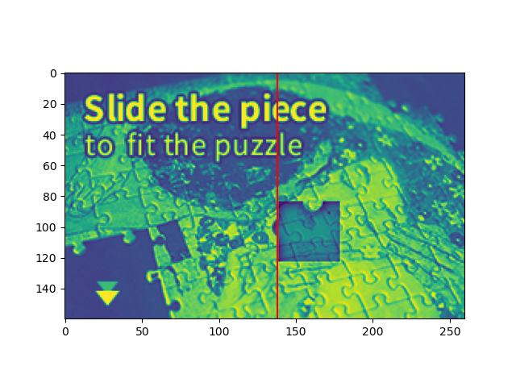

# [验证码识别](https://github.com/yylime/hdyzm)
   - 目前在优化距离计算和、优化滑动方式跳过机器测试
   - 测试[极验验证码](https://www.geetest.com/en/demo)通过（2022年1月5日）
   - 测试[网易易盾](!http://dun.163.com/trial/sense)通过（2021年12月27日）

如果大家有测试网站，欢迎在issues中提出。

### 实际效果

1. 运行录制


2. 距离计算可视化



### 开发环境

```python
# env
ubuntu-18.04 + vscode + python-3.7(miniconda)+ chrome(96.0.4664.110)
```
1. 配置python环境（建议[miniconda](https://docs.conda.io/en/latest/miniconda.html)），然后安装如下依赖

```python
# requirements
selenium==4.0.0
pillow
numpy
scipy
matplotlib
```

2. 下载对应版本的chromedriver到chromedriver目录下（如果使用windows注意修改setting.py中对应的路径）[官方地址](https://chromedriver.chromium.org/downloads)     [镜像地址](https://npm.taobao.org/mirrors/chromedriver/)

### 运行

   ```python
   # 默认测试为网易易盾
   python main.py
   # 也可以指定测试网站，目前额外只支持极验验滑动证码测试
   python main.py --name jiyan
   ```

### 常见问题

1. 滑动验证码如果出现滑动不流畅，请参考 https://blog.csdn.net/qq_36250766/article/details/100541705
